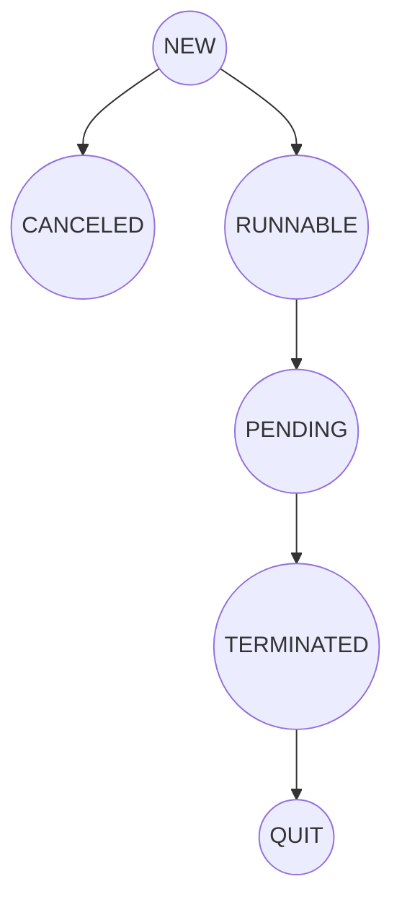
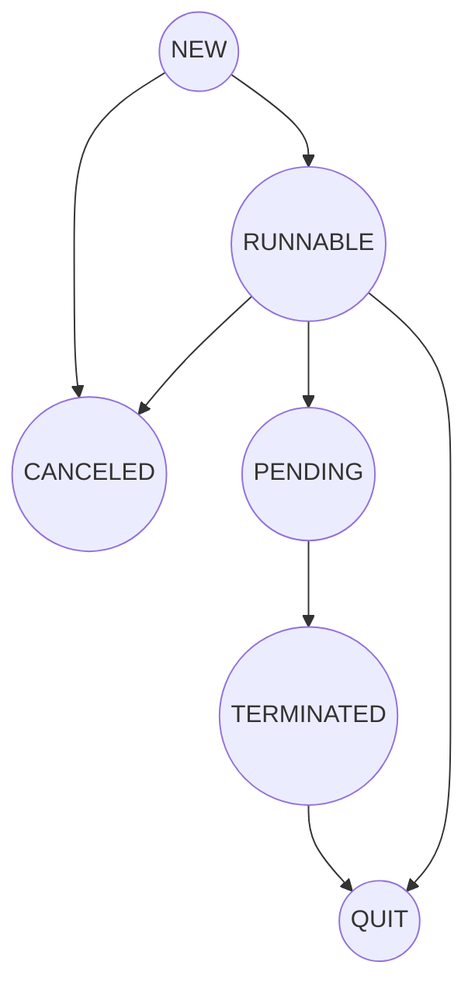

# 任务调度器简明
欢迎使用任务调度器简明，有以下细节说明。

## 背景(BACKGROUND)
现实生活中人们工作时会遇到许多事务，在特定情况下可能变得很棘手，即使它原来的庐山真面目很清晰明了。<br/>
同样，映射到虚拟世界里也大概一样，在0和1的世界里。通过不断学习、不断实践、不断总结，人们逐步掌握了一套<br/>
科学的理论和工具管理工作中的事务，在生产管理、经营管理、公司治理、项目管理和信息管理等等不同领域。<br/>
在这里，我们稍微针对虚拟世界中的事务来抽象出一个比较简单的框架作简明阐述。<br/>

## 环境(DEVELOPMENT ENVIRONMENT)
Java环境版本：JDK1.6及以上。<br/> Android环境版本：不限特定版本、无权限申请和组件申明。<br/>Lambda：可选使用，根据IDE或打包发布支持。

## 功能(FEATRUE)

##### 阐述
任务调度器(下称为“调度器”)是一个对支持Java语言环境下的用户程序事务(单一或若干集合，事务、任务等下称为“请求”，其等待结果过程下称“响应”)<br/>
和系统线程资源操作记录、调配、监控和反馈的异步处理框架。API为原生封装支持但有区别于CompletionService和CompletableFuture。<br/>
通常在不影响main线程情况下，执行一个异步请求，需要实现一个Runnable或Callable接口，开启一个线程来完成异步请求并得到结果，<br/>
另外还可以通过ExecutorService提供的线程池功能来完成。如上背景提到，情况变得复杂起来，将要执行多个请求，系列请求可能有相互作用、<br/>
协调情况，而这个时候用户该如何操作呢，是否还会面临其他问题，如请求和线程运行状态、资源复用回收、内存泄露、异常退出等等，往往用户对JDK<br/>
熟悉程度以及JDK对设备环境的要求也决定着结果的走向。而这一系列的操作和问题处理，调度器的封装或许可以很好地帮助用户提升使用体验和解决问题。<br/>

##### API和功能简明

##### 调度器(SCHEDULER)
调度器服务LoopService是所有其他API的基础，其内部主要包含访问器、流量控制器、执行器、记录器和监控器。<br/>
LoopService包含执行请求、取消请求、清理请求、停止服务、膨胀升级和监听服务等接口，<br>
推荐全局维护一个可用的调度器服务。<br>

```java
class App {
    private static LoopService loopService = LoopBuilder.create().build();
    public LoopService getLoopService() {
        return loopService;
    }
}
```
调度器服务的API如下<br/>

 | Function    | Return Type |      Description           |
 | ------------|-------------|-----------------------------|
 | `ping(Request<?>... requests)`   |     Response     | 入参为单个或若干请求，用于并发序列，返回响应服务 |
 | `ping(Collection<Request<?>> requests)` |  void | 入参为请求集合，用于串行序列，依次根据优先级、有序集合特性执行|
 | `ping(Request<?> request, Scheduler scheduler)` |  void | 入参为请求与时间表，用于定时序列，同上受流量控制器监控 |
 | `pong(MechanicOperator listener)` |  void | 观察调度器运行状态|
 | `getRequestInfo(int requestId)` |  RequestInfo | 获取对应Id请求信息|
 | `getRequestInfo()` |  List<RequestInfo> | 获取所有请求信息|
 | `removeIf(int requestId)` |  boolean | 尝试移除正在或将要执行的对应Id请求，true为移除成功，false为失败或不能重复移除|
 | `clear()` |  void | 尝试清除正在或将要执行的所有请求|
 | `fork()` |  boolean | 尝试膨胀升级调度器服务，多用于IO密集型等请求的分治策略|
 | `stop()` |  void | 停止并销毁调度器服务|
 | `isStopped()` |boolean| 调度器服务是否停止，true为停止状态|

##### 配置(CONFIGURATION)
LoopBuilder用于构建调度器实例。调度器仅能通过LoopBuilder来创建。<br/>
LoopBuilder的属性如下<br/>
  * +CPU_COUNT属性: Runtime.getRuntime().availableProcessors(),虚拟机可用核心数.
  * +CORE_POOL_SIZE属性: Math.max(2, Math.min(CPU_COUNT, 4) - 1)，避免饱和。
  * +MAXIMUM_POOL_SIZE属性: CPU_COUNT * 2。
  * -capacity属性：请求输入容量，在请求数量达到该值时不再接受请求，直到任意数量的请求完成。默认Integer.MAX_VALUE。
  * -corePoolSize属性：对应线程池的基本大小。默认LoopBuilder.CORE_POOL_SIZE。
  * -maximumPoolSize属性：对应线程池中允许的最大线程数。默认LoopBuilder.MAXIMUM_POOL_SIZE。
  * -keepAliveTime属性：非核心线程处在空闲状态的时间超过该值会退出，核心线程参照allowAliveTimeOut。默认60秒。 
  * -unit属性：空闲时间单位。默认秒。
  * -allowAliveTimeOut属性：是否允许核心线程空闲超时退出。默认true，true时keepAliveTime须大于0。
请注意设备环境线程数最优数量设置、运用场景。如多容器下避免资源浪费、IO密集型计算调度器膨胀升级场景，<br/>
在膨胀升级时维持capacity、corePoolSize。<br/>
“调度器”中代码示例`LoopBuilder.create().build()`适合大多场景情况，请酌情调整设置。<br/>
```
public static LoopService main(String[] args) {
    LoopBuilder builder = new LoopBuilder()
        .setCorePoolSize(2)
        .setMaximumPoolSize(3)
        .keepAliveTime(60L)
        .setUnit(TimeUnit.SECONDS)
        .allowAliveTimeOut(true)
    return builder.build();
}
```
##### [状态机](https://baike.baidu.com/item/%E7%8A%B6%E6%80%81%E6%9C%BA/6548513?fr=aladdin) (FSM)
状态机是一种电路设计的概念，在软体中叫做有限状态机FSM(Finite State Machine)，能够根据控制信号按照预先<br/>
设定的状态进行状态转移，是协调相关信号动作、完成特定操作的控制中心。包含四个要素即现态、条件、动作、次态，公式如<br/>
State(S) x Event(E) -> Actions (A), State(S')<br/>
    ①现态：是指当前所处的状态。<br/>
    ②条件：又称为“事件”，当一个条件被满足，将会触发一个动作，或者执行一次状态的迁移。<br/>
    ③动作：条件满足后执行的动作。动作执行完毕后，可以迁移到新的状态，也可以仍旧保持原状态。动作不是必需的，当条件满足后，也可以不执行任何动作，直接迁移到新状态。<br/>
    ④次态：条件满足后要迁往的新状态。“次态”是相对于“现态”而言的，“次态”一旦被激活，就转变成新的“现态”了。<br/>
在虚拟的编程世界中，我们可以用状态机模型来描述多样性的对象状态，一般情况下每个对象可以拥有一个状态机。<br/> 
对象有多种状态，这些状态可以互相转化。从一个状态，转到另外一个状态，中间可以经过其他状态节点。<br/>
经过或到达一个节点可以传递信息和触发想要发生的行为以达到次态。<br/>

  * 同步状态机<br/>
  该状态机的Action操作是同步进行的,在当前线程环境运行，Jdk或Android环境使用。
    * 继承com.u2020.sdk.sched.finitestate.StateMachine抽象类，是封装好的树桩结构状态机，仅需定义继承它并使用暴露的接口。
      ```java 
      public class SyncStateMachine extends StateMachine {
        protected SyncStateMachine(String name) {
                super(name); 
                //addState(...);//添加父子状态关系
                //addState(...);
                //...
                //setInitialState(...);//设置初始状态
            }  
        
            @Override
            protected void haltedProcessMessage(Transporter var) {//所传递信息
                //状态机onHalting()方法可中断转移操作，触发此方法
            }
        
            @Override
            protected void onHalting() {
                //状态机到达中断状态     
            }
        
            @Override
            protected void onQuitting() { 
                 //状态机onQuitting()方法可退出状态机，触发此方法
            }
      }
      ```
    * 实现com.u2020.sdk.sched.finitestate.State接口定义不同状态，从进入到退出该状态时触发对应方法, 次态变为现态apply触发。<br/>
        ```java
        class mS3 extends State {
                @Override
                public void enter() {
                    super.enter();
                }
        
                @Override
                public void exit() {
                    super.exit();
                }
        
                @Override
                public Boolean apply(Transporter msg) { 
                    //处理信息、也可以转移下一个状态 
                    return HANDLED;//HANDLED为在apply处理信息，NOT_HANDLED则不在此做功转移父节点状态处理，若无父节点则转移状态机unhandledMessage方法
                }
            }
        ```
    * 状态机使用
        ```
            public static void main(String[] args) {
                 StateMachine fsm = new SyncStateMachine("FSM");
                 fsm.start();//开启状态机
                 fsm.transitionTo(mS0, msg);//实现状态转移和传递信息操作。 
            }
        ```
  * 异步状态机<br/>
   该状态机的Action操作是异步进行的,在子线程环境运行，仅对Android环境使用。
    * 继承com.u2020.sdk.sched.internal.hms.AsyncStateMachine。
        ```java
        public class Hsm extends AsyncStateMachine {
            public Hsm(String name) {
                super(name); 
                 //addState(...);//添加父子状态关系...
                 //setInitialState(...);//设置初始状态
            }
        
            @Override
            protected void onHalting() { 
                synchronized (this) {
                    this.notifyAll();
                }
            }
        
            @Override
            protected void onQuitting() { 
            }
            //状态机不同的操作事务
            private void invokeAction() {
                //transitionTo(mS0);//状态机保护方法，状态转移
                //deferMessage(message);//状态机保护方法，传递信息
                //transitionToHaltingState();//状态机保护方法，中断转移
                //quit();//或quitNow, 状态机保护方法，退出状态机，后者清除延时消息
            }
        }
        ```
    * 实现com.u2020.sdk.sched.internal.hms.AsyncState接口定义不同状态。
      ```java
        class mS3 extends AsyncState {
                @Override
                public void enter() {
                    super.enter(); 
                }
        
                @Override
                public void exit() {
                    super.exit(); 
                }
        
                @Override
                public boolean processMessage(Message message) {
                    //处理信息、也可以转移下一个状态  
                    return HANDLED;
                }
            }
      ```
    * 状态机使用
       ```
           public static void makeFsm() {
                AsyncStateMachine fsm = new Hsm("FSM");
                fsm.start();//开启状态机
                fsm.sendMessage(hi.obtainMessage());//发送异步消息，遍历状态节点。 
           }
       ```
##### 创建请求(CREATE REQUEST)
RequestExecutors用于构建用户特别定义的请求，具体的接口实现即用户的业务将会被封装进Request服务，包含构建类型如下<br/>
   * 获取结果为Void的Runnable请求
   
       `Request<Void> pingable(Runnable runnable)`
       
   * 获取结果为默认输入值的Runnable请求
   
        `Request<T> pingable(Runnable runnable, T value)`
   
   * 获取结果为泛型的Supplier请求
   
        `Request<T> pingable(Supplier<T> supplier)`
   
   * 获取结果为Void的Consumer共享传导信息请求，Request之间通过Transporter共享信息
   
        `Request<Void> pingable(Consumer<AtomicReference<Transporter>> consumer)`
   
   * 获取结果为默认输入值的Consumer请求
   
        `Request<T> pingable(Consumer<AtomicReference<Transporter>> consumer, T value)`
   
   * 获取结果为泛型的ConsumableFunction共享传导信息请求，Request之间通过Transporter共享信息
   
        `Request<T> pingable(ConsumableFunction<T, AtomicReference<Transporter>> function)` 


Request服务的API如下<br/>

 | Function    | Return Type |      Description           |
 | ------------|-------------|----------------------------|
 | `getId()`   |     int     | 获取本地唯一请求Id，**自增非连续** |
 | `setName(String name)` |  Request<T> | 可选，设置请求的名称|
 | `getName()` |  String | 获取请求名称|
 | `setPriority(int priority)` |  Request<T> | 可选，设置请求执行优先级，缺省0，最大Integer.MAX_VALUE。串联序列生效|
 | `getPriority()` |  int | 获取请求优先级，仅串联序列生效|
 | `getCreationTime()` |  long | 获取请求创建时间，单位毫秒|
 | `addListener(BiConsumer listener)` |  Request<T> | 增加请求的结果观察者，回传信息含请求信息、结果、可能的异常信息|
 | `addListener(CancelableBiConsumer listener)` |  Request<T> | 同BiConsumer，含取消请求后回传|
 | `getState()` |  String | 获取请求状态机的现态|
 | `isFinished()` |  boolean | 请求是否完成(现态为TERMINATED), true为完成|
 | `cancel(boolean mayInterruptIfRunning)` |  boolean | 入参为true表示中断线程。切换次态CANCELED，返回true表示取消成功，现态为非New时返回false|
 | `isCanceled()` |  boolean | cancel后请求是否取消(现态为CANCELED)，true为取消|
 | `get()` |  泛型 | 获取请求返回值，非阻塞|
 | `get(Long timeout, TimeUnit unit)` |  泛型 | 获取请求返回值，阻塞，经过时间单位为unit的时间timeout后仍无返回则抛出TimeoutException，此时get()可能为默认值|
         
Request服务的现态类型如下<br/>
```
String NEW = "NEW";//初始状态(新)
String RUNNABLE = "RUNNABLE"; //运行状态
String PENDING = "PENDING";//响应分发状态
String TERMINATED = "TERMINATED";//完成状态
String CANCELED = "CANCELED";//取消状态
String QUIT = "QUIT";/退出状态
```
状态数据结构如下<br/>

现态和次态逻辑即切换关系如下<br/>


##### 串行序列(SERIAL SEQUENCE)
串行序列是用户创建的一系列设置了优先级的相同或不同构建类型的请求Collection集合。<br/>
执行串联序列的顺序按优先级高低，调度器接口如下<br/>
```java
public interface LoopService {
    void ping(Collection<Request<?>> requests);
}
``` 
示例：&nbsp;输出结果依次为Hi、Hello、How are you<br/>
```java
class Demo {
    public static void main(String[] args) {
        LoopService loopService = App.getLoopService();
        Request<Void> hi = RequestExecutors.pingable(() -> System.out.println("Hi"));
        hi.setPriority(3);
        Request<Void> hello = RequestExecutors.pingable(() -> System.out.println("Hello"));
        hi.setPriority(2);
        Request<Void> how = RequestExecutors.pingable(() -> System.out.println("How are you"));
        hi.setPriority(1);
        Collection<Request<?>> collection = new HashSet<>();
        collection.add(hi);
        collection.add(hello);
        collection.add(how);
        loopService.ping(collection);  
    }
}
```
当优先级相同时可能存在请求同时执行情况，也可能先后执行情况，若不设置优先级(有序集合FIFO)，如下效果等同<br/>
```java
class Demo {
    public static void main(String[] args) {
        LoopService loopService = App.getLoopService();
        Request<Void> hi = RequestExecutors.pingable(() -> System.out.println("Hi"));
        Request<Void> hello = RequestExecutors.pingable(() -> System.out.println("Hello"));
        Request<Void> how = RequestExecutors.pingable(() -> System.out.println("How are you"));
        Collection<Request<?>> collection = new ArrayList<>();
        collection.add(hi);
        collection.add(hello);
        collection.add(how);
        loopService.ping(collection);  
    }
}
```
##### 并发序列(CONCURRENT SEQUENCE)
并发序列是用户创建的一系列相同或不同构建类型的请求Collection集合。<br/>
并发序列执行遵循后入先出(Last In First Out)的原则消费，调度器接口如下<br/>
```java
public interface LoopService {
    Response ping(Request<?>... requests);
}
```
示例：&nbsp;输出结果根据设备执行情况而定<br/>
```java
class Demo {
    public static void main(String[] args) {
        LoopService loopService = App.getLoopService();
        Request<Void> hi = RequestExecutors.pingable(() -> System.out.println("Hi"));
        Request<Void> hello = RequestExecutors.pingable(() -> System.out.println("Hello"));
        Request<Void> how = RequestExecutors.pingable(() -> System.out.println("How are you"));
        loopService.ping(hi, hello, how);//just say hi if: ping(hi)
    }
}
```

##### 定时序列(SCHEDULED SEQUENCE)
定时序列是用户创建的一系列相同或不同构建类型和包含有时间表的定时请求。<br/>
时刻表安排可以是延期的、间隔的、有频率的、循环的表现形式，调度器接口如下<br/>
```java
public interface LoopService {
    void ping(Request<?> request, Scheduler scheduler);
}
```
时间表Scheduler属性如下<br/> 

| Field        | Type     | Description                             |
|--------------|----------|-----------------------------------------|
| loop         | boolean  | 定时请求是否循环执行，true为循环执行。受流量控制器监控，应避免短时循环请求 |
| frequency    | int      | 定时请求执行频率(次数)，大于0，loop为false时生效          |
| delayTime    | long     | 可选，定时请求延时执行时间                           |
| internalTime | long     | 下次定时请求相隔的时间。受流量控制器监控，应避免短时高频率请求         |
| timeUnit     | TimeUnit | 时间单位                                    |

示例：&nbsp;输出结果延时1秒输出三次Hi,每次相隔1秒<br/>
```java
class Demo {
    public static void main(String[] args) {
        LoopService loopService = App.getLoopService();
        Scheduler scheduler = new Scheduler();
        scheduler.frequency = 3;
        scheduler.delayTime = 1;
        scheduler.internalTime = 1;
        scheduler.timeUnit = TimeUnit.SECONDS; 
        Request<Void> hi = RequestExecutors.pingable(() -> System.out.println("Hi"));
        loopService.ping(hi, scheduler);
    }
}
```
示例：输出结果每相隔1秒输出Hi<br/>
```java
class Demo {
    public static void main(String[] args) {
        LoopService loopService = App.getLoopService();
        Scheduler scheduler = new Scheduler(); 
        scheduler.loop = true;
        scheduler.internalTime = 1;
        scheduler.timeUnit = TimeUnit.SECONDS; 
        Request<Void> hi = RequestExecutors.pingable(() -> System.out.println("Hi"));
        loopService.ping(hi, scheduler);
    }
}
```
##### 请求队列(QUEUE)
> 串联序列: &nbsp;FIFO<br/> 
> 并发序列: &nbsp;LIFO<br/>
> 定时序列: &nbsp;FIFO ORDER BY TIME<br/>
> 并行序列: &nbsp;LIFO&nbsp;(DEFAULT, the other mode:&nbsp;FIFO)<br/>

执行优先级: &nbsp;定时序列 &nbsp; >  &nbsp;并发序列 = 串联序列<br/> 

##### 请求响应(RESPONSE)
有时候用户去操作执行请求之后希望得到响应，而这个响应有可能是成功的、取消的甚至是异常可怕的情况。<br/>
调度器提供给用户不同的解决方案，取决于用户不同的事务性行为：<br/> 
1. Request接口<br/> 
该接口的请求响应功能作用范围仅限来源于RequestExecutors的构建。
   * `get()`<br/> 
     该方法在当前线程是非阻塞性的，当确定请求正常完成时，能获预设结果，否则可能是空或pingable指定的填充值。<br/>
     ```java
     class Demo {
         public static void main(String[] args) throws InterruptedException {
             LoopService loopService = App.getLoopService();
             Request<String> hi = RequestExecutors.pingable(() -> "hi");
             loopService.ping(hi);
             TimeUnit.MILLISECONDS.sleep(10);
             System.out.println(hi.get());
         }
     }
     ```
   * `get(Long timeout, TimeUnit unit)`<br/>
     该方法在当前线程是阻塞性的，当确定请求在限定时间内完成，可立马获预设结果，否则抛出超时异常。<br/> 
        ```java
            class Demo {
                public static void main(String[] args) throws TimeoutException {
                    LoopService loopService = App.getLoopService();
                    Request<String> hi = RequestExecutors.pingable(() -> "hi");
                    loopService.ping(hi); 
                    System.out.println(hi.get(10L, TimeUnit.MILLISECONDS));
                }
            }
        ```
   * `isCanceled()`<br/> 
      该方法可确定请求取消状态，true为已经取消。<br/>
       ```java
               class Demo {
                   public static void main(String[] args) {
                       LoopService loopService = App.getLoopService();
                       Request<String> hi = RequestExecutors.pingable(() -> "hi");
                       loopService.ping(hi);
                       System.out.println(String.valueOf(hi.isCanceled()));
                   }
               }
       ```
   * `addListener(BiConsumer<Pair<RequestInfo, T>, ? super Error> listener);`<br/>
      该方法可监听请求响应，仅限于现态为NEW时即执行请求前使用，Pair集合中first属性为请求信息，second为返回值，Error不为空则表示请求异常。
        ```java
             class Demo {
                 public static void main(String[] args) { 
                      LoopService loopService = App.getLoopService();
                      Request<String> hi = RequestExecutors.pingable(() -> "hi");
                      hi.addListener((pair, error) -> {
                         if (error == null)
                             System.out.println(pair.second);
                             else error.printStackTrace();
                      });
                      loopService.ping(hi);
                 }
             }
        ```
   * `addListener(CancelableBiConsumer<Pair<RequestInfo, T>, ? super Error> listener);`<br/> 
      该方法同上，不同的地方在于接口多了一个取消通知回传方法。
       ```java
        class Demo {
            public static void main(String[] args) { 
                 LoopService loopService = App.getLoopService();
                 Request<String> hi = RequestExecutors.pingable(() -> "hi");
                  hi.addListener(new CancelableBiConsumer<Pair<RequestInfo, String>, Error>() {
                             @Override
                             public void cancel(Pair<RequestInfo, String> pair) {
                                 System.out.println(pair.second);
                             }
                 
                             @Override
                             public void accept(Pair<RequestInfo, String> pair, Error error) {
                                 if (error == null)
                                     System.out.println(pair.second);
                                 else error.printStackTrace();
                             }
                         });
                 loopService.ping(hi);
            }
        }
       ```
2. Response接口<br/>
该接口作用范围仅限于并发序列的请求。针对用户发起的请求组合，访问器提供的Response服务API如下
   * `allOfComplete(CompletionConsumer<Pair<RequestInfo, ? super Object>[], ? super Object> allOfCompletion);`<br/> 
     `allOfComplete(BiCompletionConsumer<Pair<RequestInfo, ? super Object>[], ? super Object> allOfCompletion);`<br/> 
     该方法仅当所有组合内的请求完成时方触发回传，仅触发一次。Pair数组是所有请求响应集合(请求信息、响应结果), ? super Object为用户andThen操作中从accept计算回传结果类型。   
   * `oneOfComplete(CompletionConsumer<Pair<RequestInfo, ? super Object>, ? super Object> oneOfCompletion);`<br/> 
     `oneOfComplete(BiCompletionConsumer<Pair<RequestInfo, ? super Object>, ? super Object> oneOfCompletion);`<br/> 
     该方法当组合内的其中一个请求(最先)完成时方触发回传，仅触发一次。Pair为当前请求响应集合(请求信息、响应结果), ? super Object为用户andThen操作中从accept计算回传结果类型。  
   * `anyOfComplete(CompletionConsumer<Pair<RequestInfo, ? super Object>, ? super Object> anyOfCompletion);`<br/> 
     `anyOfComplete(BiCompletionConsumer<Pair<RequestInfo, ? super Object>, ? super Object> anyOfCompletion);`<br/> 
     该方法当组合内的任意一个请求完成时方触发回传，可多次触发。Pair为当前请求响应集合(请求信息、响应结果), ? super Object为用户andThen操作中从accept计算回传结果类型。          
   * `thenRun(Runnable runnable);`<br/> 
     该方法当组合所有请求执行完成或不再继续执行的时候触发回传，仅触发一次，runnable是用户的下一步事务性接口。   
   * `orThrowable(BiConsumer<RequestInfo, ? super Error> throwable);`<br/>  
     该方法当组合内的任意一个请求有异常发生时触发回传，可多次触发。 
     ```java
     class Demo {
         public static void main(String[] args) {
             LoopService loopService = App.getLoopService();
             Request<String> hi = RequestExecutors.pingable(() -> "Hi");
             Request<String> hello = RequestExecutors.pingable(() -> "Hello");
             Request<String> how = RequestExecutors.pingable(() -> "How are you");
             Response response = loopService.ping(hi, hello, how);
             response.oneOfComplete(pair -> {
                         System.out.println("oneOf:" + pair.second);
                         return null;
             }).anyOfComplete(pair -> {
                         System.out.println("anyOf:" + pair.second);
                         return null;
             }).allOfComplete(pairs -> {
                         System.out.println("allOf:" +pairs.length);
                         return null;
            }).orThrowable((requestInfo, error) -> {error.printStackTrace();});
         }
     }
     ```   
##### 共享传导(SHARED TRANSPORTER)
**串行序列共享传导池是独立的，不参与并发序列和定时序列的共享。**<br/>
1.串行序列<br/>
```java
class Pingable<T> {
    public T applyOrAccept(AtomicReference<Transporter> transporter) {
        Transporter pre = transporter.get();
        Object var = pre.optObject("var");
        T result = caculate(var);
        
        //可创建新的共享池
        Transporter newOne = new Transporter();
        newOne.putObject("var", new Object());
        transporter.compareAndSet(pre, newOne);

        return result;
    }
}
```
2.并发序列和定时序列<br/>
```java
class Pingable<T> {
    public T applyOrAccept(AtomicReference<Transporter> transporter) {
        Transporter pre = transporter.get();
        Object var = pre.optObject("var");
        T result = caculate(var);
        
        //可创建新的共享池
        Transporter newOne = new Transporter();
        newOne.putObject("var", new Object());
        while (!transporter.compareAndSet(pre, newOne)){
            pre = transporter.get();
        }
        return result;
    }
}
```
##### 请求取消(CANCEL)
在现态变为完成退出之前，用户提交了请求之后仍然有机会尝试取消，它可能不需要再被调度器执行以免对用户产生事务性影响。<br/>
调度器提供给用户不同的解决方案，取决于用户不同的上下文环境：
1. Request接口<br/> 
    `boolean cancel(boolean mayInterruptIfRunning);`<br/> 
    * mayInterruptIfRunning为true时，现态为RUNNABLE的请求工作线程将尝试中断。
    * 取消成功方法返回true，此时isCanceled()同样为true，现态为非New时返回false即请求已经执行或已取消退出。
     ```java
     class Demo {
         public static void main(String[] args) {
             LoopService loopService = App.getLoopService();
             Request<Void> hi = RequestExecutors.pingable(() -> System.out.println("Hi"));
             loopService.ping(hi); 
             hi.cancel(true);
         }
     }
     ```
2. LoopService接口<br/> 
    `boolean removeIf(int requestId);`<br/> 
    效果同上，但效率不比Request接口。<br/> 
    ```java
     class Demo {
         public static void main(String[] args) {
             LoopService loopService = App.getLoopService(); 
             loopService.removeIf(requestId);//requestId = request.getId();
         }
     }
    ```
    
##### 请求信息(REQUEST INFO)
RequestInfo的私有属性如下<br/>

| Field          | Type   | Description  |
|----------------|--------|--------------|
| id             | int    | 请求的Id        |
| name           | String | 请求的名称        |
| creationTime   | long   | 请求的创建时间，单位毫秒 |
| completionTime | long   | 请求的完成时间，单位毫秒 |
| cancelTime     | long   | 请求的取消时间，单位毫秒 |

##### 请求记录(RECORD)
##### 调度器清理(CLEAR)
用户程序在合适时机可清理调度器资源，如退出程序前，调度器将移除现态为NEW或RUNNABLE的请求和释放资源。<br/>
`void clear();`
 ```java
 class Demo {
     public void clear() {
         LoopService loopService = App.getLoopService(); 
         loopService.clear();
     }
 }
```
##### 工作分治(WORK STEALING)
复杂的系统有数目众多的元素组成，元素之间关系又很复杂，并有多种层次结构。我们对复杂事务做分析的时候，<br>
往往也可以采用一种分治思想，即分而治之：一个复杂的事务分成若干类似的子事务，再把子事务分成<br>
更小的子事务......直到最后子事务可以简单直接解决，原事务的解决方案即子事务解决方案的集合。<br>
在Java中这种思想实践为工作窃取算法，其最直接表现方式是从Jdk1.7版本开始支持线程池中某个空闲线程<br>
从其他队列里窃取任务来执行，而其队列中的任务可以做分治执行和结果合并。<br>
##### 线程池膨胀(FORK)
在IO密集型等工作场景，用户使用调度器中的线程池膨胀功能可尝试将一般线程池升级为ForkJoinPool,<br>
fork()返回true则升级成功，现态为NEW的请求将被移除，返回false则升级失败而调度器原有功能和请求未受影响。<br>
`boolean fork();`
 ```java
 class Demo {
     public void fork() {
         LoopService loopService = App.getLoopService(); 
         loopService.fork();
     }
 }
```
##### 并行序列(PARALLEL SEQUENCE)
Jdk环境：1.7版本。Android环境：android8, API26版本。<br>
调度器膨胀成功后，用户的runnable实现类继承java.util.concurrent.ForkJoinTask并封装相关父子事务。<br>
`Request<Void> pingable(Runnable runnable)`<br>
`Request<T> pingable(Runnable runnable, T value)`<br>

##### 调度器监控(MONITOR)
##### 序列化(SERIALIZATION)
##### 反序列化(DESERIALIZATION)
##### 调度器关闭(STOP)
用户程序在合适时机可关闭调度器，如不需要调度器继续工作，调度器将清除队列缓存、关闭线程池、退出相关线程和释放资源。<br/>
再次启动调度器需要重新创建才能正常使用其功能。<br/>
`void stop();`
 ```java
 class Demo {
     public void stop() {
         LoopService loopService = App.getLoopService(); 
         loopService.stop();
     }
 }
```
## 项目结构(STRUCTURE)
    +----------------------------------------------------+
    |                                                    |
    |                   ASYNC4A API                      |
    |                                                    |
    +----------------------------------------------------+
    +----------+ +----------+ +------------+ +-----------+
    |          | |                         | |           | 
    | -Request | |       -LoopService      | | -Response |
    |          | |                         | |           |
    +----------+ +----------+ +------------+ +-----------+
    +-----------------------+ +--------------------------+
    |                       | |                          |
    |     -RunnableContext  | |    -ScheduledContext     |   
    |                       | |                          |
    +-----------------------+ +--------------------------+
    +----------------------------------------------------+ 
    |                    -Context                        |
    +----------------------------------------------------+
    +-------------------SDK Framework--------------------+
    |            |                   |            |      |
    | -Visitor   | -RequestExecutors |    -hms    | ...  |
    |            |                   |            |      |
    +----------------------------------------------------+

## 集成指南(USAGE)
Gradle:implementation files("async4a_3.3.24_beta_2023030919.jar")

## 测试(TESTING)
参考项目androidTest和test

## 混淆(PROGUARD)
-keep class com.u2020.sdk.sched.** { *; }

## FAQ

Q:&nbsp;LoopService与CompletionService和CompletableFuture之间有什么区别<br/>
A:&nbsp;LoopService比CompletionService更加灵活和多样性，CompletableFuture功能更加完善但在Jdk1.8才开始支持。<br/>

Q:两种状态机是线程安全的吗？<br/>
A:&nbsp;1.异步线程安全的，一个状态机本质代表一个线程。<br/>
&nbsp;&nbsp;&nbsp;&nbsp;2.同步状态机的状态获取和状态转换是线程安全的。

Q:&nbsp;调度器所有回传方法的线程环境是什么？<br/>
A:&nbsp;&nbsp;回传方法所处环境为子线程。<br/>

Q:&nbsp;如果之前发起了很多请求，现在我有紧急请求想插队到前面那怎么办？<br/>

A:&nbsp;可以尝试去执行一个携带空时间表(所有属性都不用设置)的定时请求，它会排在队列前面。<br/>
